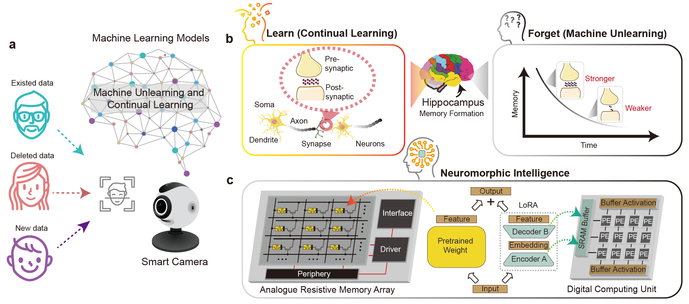

# Machine Unlearning and Continual Learning in Hybrid Resistive Memory Neuromorphic Systems

Resistive memory (RM) based neuromorphic systems can emulate synaptic plasticity and thus support continual learning, but they generally lack biologically inspired mechanisms for active forgetting, which are critical for meeting modern data privacy requirements. Algorithmic forgetting, or machine unlearning, seeks to remove the influence of specific data from trained models to prevent memorization of sensitive information and the generation of harmful content, yet existing exact and approximate unlearning schemes incur prohibitive programming overheads on RM hardware owing to device variability and iterative write-verify cycles. Analogue implementations of continual learning face similar barriers. Here we present a hardware-software co-design that enables an efficient training, deployment and inference pipeline for machine unlearning and continual learning on RM accelerators. At the software level, we introduce a low-rank adaptation (LoRA) framework that confines updates to compact parameter branches, substantially reducing the number of trainable parameters and therefore the training cost. At the hardware level, we develop a hybrid analogue-digital compute-in-memory system in which well-trained weights are stored in analogue RM arrays, whereas dynamic LoRA updates are implemented in a digital computing unit with SRAM buffer. This hybrid architecture avoids costly reprogramming of analogue weights and maintains high energy efficiency during inference. Fabricated in a 180 nm CMOS process, the prototype achieves up to a 147.76-fold reduction in training cost, a 387.95-fold reduction in deployment overhead and a 48.44-fold reduction in inference energy across privacy-sensitive tasks including face recognition, speaker authentication and stylized image generation, paving the way for secure and efficient neuromorphic intelligence at the edge.

## Tasks Demo
- 🧑‍🤝‍🧑 Face Recognition 
- 🗣️  Speaker Authentication
- 🖼️  Image Generation

### LICENSE
MIT License

Copyright (c) Department of Electrical and Electronic Engineering, the University of Hong Kong
All rights reserved.

Permission is hereby granted, free of charge, to any person obtaining a copy
of this software and associated documentation files (the "Software"), to deal
in the Software without restriction, including without limitation the rights
to use, copy, modify, merge, publish, distribute, sublicense, and/or sell
copies of the Software, and to permit persons to whom the Software is
furnished to do so, subject to the following conditions:

The above copyright notice and this permission notice shall be included in all
copies or substantial portions of the Software.

THE SOFTWARE IS PROVIDED "AS IS", WITHOUT WARRANTY OF ANY KIND, EXPRESS OR
IMPLIED, INCLUDING BUT NOT LIMITED TO THE WARRANTIES OF MERCHANTABILITY,
FITNESS FOR A PARTICULAR PURPOSE AND NONINFRINGEMENT. IN NO EVENT SHALL THE
AUTHORS OR COPYRIGHT HOLDERS BE LIABLE FOR ANY CLAIM, DAMAGES OR OTHER
LIABILITY, WHETHER IN AN ACTION OF CONTRACT, TORT OR OTHERWISE, ARISING FROM,
OUT OF OR IN CONNECTION WITH THE SOFTWARE OR THE USE OR OTHER DEALINGS IN THE
SOFTWARE.