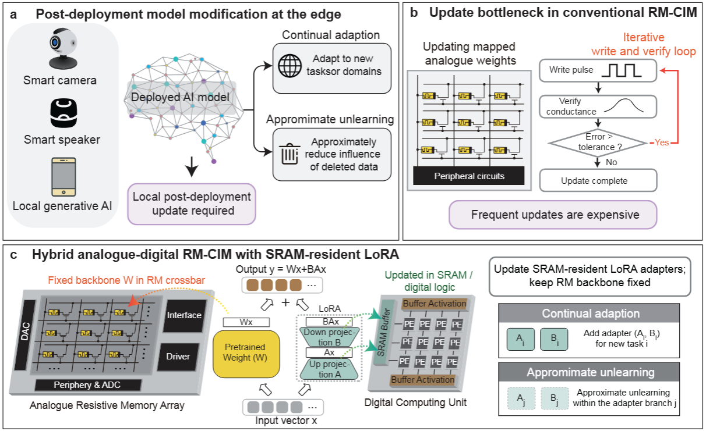

# Parameter Efficient Machine Unlearning on Hybrid Resistive Memory based Compute-in-Memory Accelerators
Resistive memory compute-in-memory accelerators provide energy efficient analogue matrix vector multiplication for neural network inference, but frequent reprogramming of analogue weights remains costly because of device variability and iterative write and verify operations. This limitation hinders their use in edge model adaptation, including approximate machine unlearning and continual learning, where model parameters may need to be updated repeatedly in response to data deletion requests or newly arriving tasks. Here we present a co-design approach across hardware and software that maps frozen pretrained weights to analogue resistive memory arrays while placing trainable low rank adaptation branches in SRAM connected digital compute. By using LoRA style parameter efficient updates, the proposed scheme confines adaptation to a small set of digital parameters and avoids repeated reprogramming of the analogue backbone. 
To our knowledge, this represents an experimental demonstration of approximate machine unlearning on a fabricated resistive memory compute-in-memory accelerator. We validate the approach on a fabricated 180 nm 128x128 1T1R resistive-memory macro using face recognition, speaker authentication and stylized image generation workloads. Compared with a baseline that updates analogue weights, the proposed mapping reduces analogue training/update cost by up to 148x, on-chip deployment overhead by up to 388x, and inference energy by up to 48x, while maintaining competitive task performance. These results show that hybrid analogue–digital LoRA mapping can enable efficient post-deployment adaptation on RM-CIM hardware, although formal machine-unlearning guarantees and large-scale system integration remain open challenges.

## Tasks Demo
- 🧑‍🤝‍🧑 Face Recognition 
- 🗣️  Speaker Authentication
- 🖼️  Image Generation

### LICENSE
MIT License

Copyright (c) Department of Electrical and Electronic Engineering, the University of Hong Kong
All rights reserved.

Permission is hereby granted, free of charge, to any person obtaining a copy
of this software and associated documentation files (the "Software"), to deal
in the Software without restriction, including without limitation the rights
to use, copy, modify, merge, publish, distribute, sublicense, and/or sell
copies of the Software, and to permit persons to whom the Software is
furnished to do so, subject to the following conditions:

The above copyright notice and this permission notice shall be included in all
copies or substantial portions of the Software.

THE SOFTWARE IS PROVIDED "AS IS", WITHOUT WARRANTY OF ANY KIND, EXPRESS OR
IMPLIED, INCLUDING BUT NOT LIMITED TO THE WARRANTIES OF MERCHANTABILITY,
FITNESS FOR A PARTICULAR PURPOSE AND NONINFRINGEMENT. IN NO EVENT SHALL THE
AUTHORS OR COPYRIGHT HOLDERS BE LIABLE FOR ANY CLAIM, DAMAGES OR OTHER
LIABILITY, WHETHER IN AN ACTION OF CONTRACT, TORT OR OTHERWISE, ARISING FROM,
OUT OF OR IN CONNECTION WITH THE SOFTWARE OR THE USE OR OTHER DEALINGS IN THE
SOFTWARE.